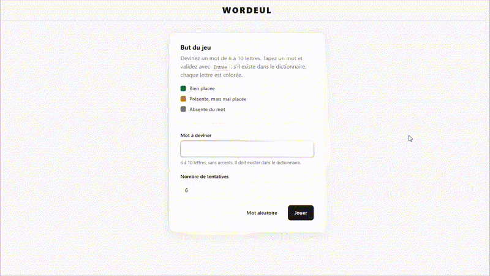
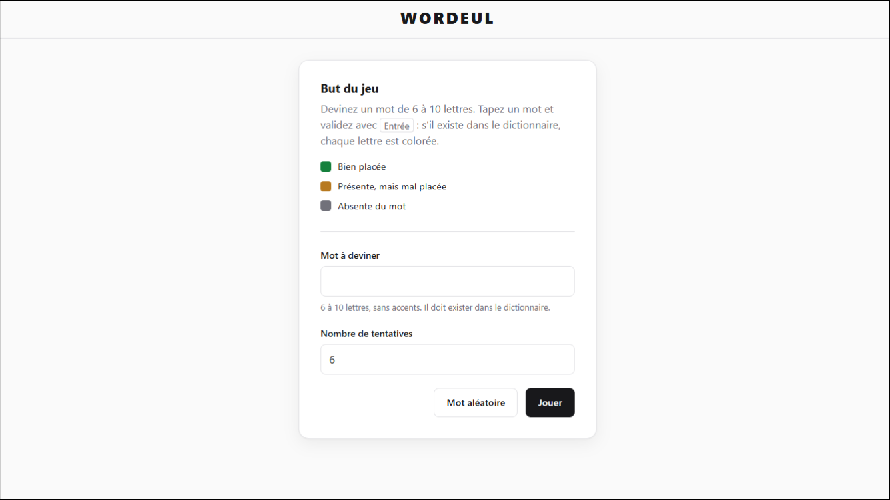
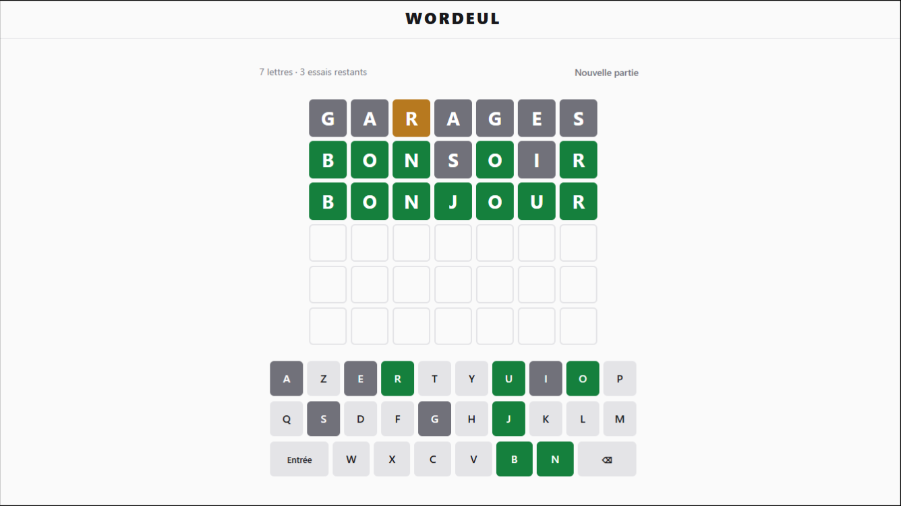
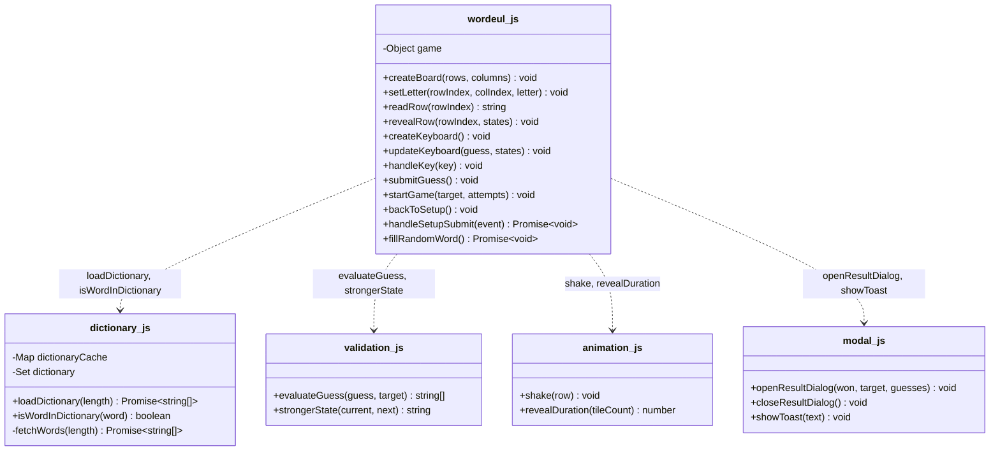

# Wordeul

A Wordle-style word guessing game built with **vanilla HTML, CSS and JavaScript** — no framework, no build step.



| Setup | Game |
|---|---|
|  |  |

## Features

- Words of **6 to 10 letters** and a configurable number of attempts (1–20)
- Pick the secret word yourself (hidden input, for two players) or draw a random one
- Correct handling of **repeated letters** (two-pass evaluation)
- Physical keyboard and on-screen **AZERTY** keyboard, with key colours that never downgrade
- Tile flip / shake animations, native `<dialog>` for the end of game
- Responsive layout, automatic **light / dark** theme, `prefers-reduced-motion` support

## Architecture

No framework, so no classes: each file is a self-contained module of functions and (for `wordeul.js`) shared game state. `wordeul.js` is the entry point and the only module that depends on the others.



## Run locally

The game fetches its word lists over HTTP, so serve the folder with any static server instead of opening the file directly:

```bash
cd wordeul-project
npx serve .
# or
python -m http.server
```

> **Note:** the word lists are fetched from HE2B–ESI's internal GitLab. If you're running this outside the school network, the dictionary may fail to load — this is a network/CORS constraint of the source, not a bug in the game itself.

Then open `http://localhost:3000/wordeul.html` (or port `8000` with Python).

## Project structure

```
README.md
docs/                  Screenshots and demo GIF used in this file
wordeul-project/
  wordeul.html          Page markup (setup screen, game screen, dialog)
  js/
    dictionary.js       Downloads and caches the word lists
    validation.js       Guess evaluation (correct / present / absent)
    animation.js         Shake animation and reveal timing
    modal.js            End-of-game dialog and toast messages
    wordeul.js          Game state, board, keyboard and event handling
  style/                One stylesheet per concern, based on CSS custom properties
```

## Code quality

```bash
cd wordeul-project
npm install
npm run lint
```

ESLint runs with a strict rule set (`.eslintrc.json`).

## Context

School project built at **HE2B - ESI** (Brussels) to practise DOM manipulation, events and asynchronous `fetch` in plain JavaScript. The word lists are provided by the school's GitLab.

## Author

**Ian Grande** - [GitHub](https://github.com/ian-grande-dev) · [LinkedIn](https://www.linkedin.com/in/ian-grande/)